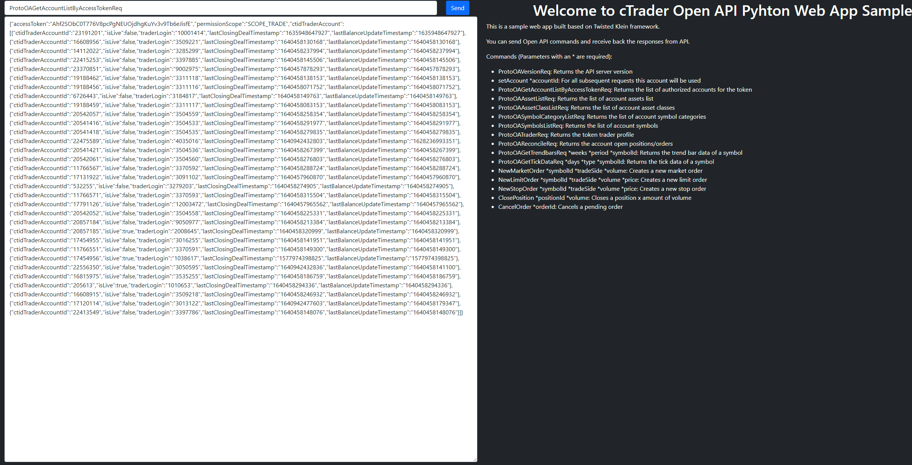

# Klein Web App Sample

This is the web sample for Spotware OpenApiPy Python package.

It's based on Twisted [Klein](https://github.com/twisted/klein) web framework.

You can send and receive API commands by using this sample, it's very similar to Console sample.

To use the sample you have to create a copy of "credentials.json" file and rename it to "credentials-dev.json".

Then fill the file with your Open API application credentials.

After that install Klein with pip:
```
pip install klein
```

Then run the "main.py" file.

Open the "localhost:8080" on your web browser.

You can escape the account authentication if you have already an access token, go to: "localhost:8080/client-area?token=your-access-token"


